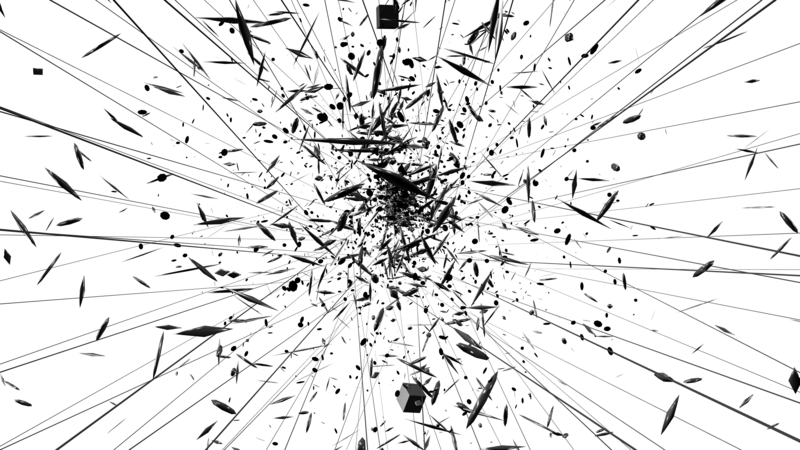
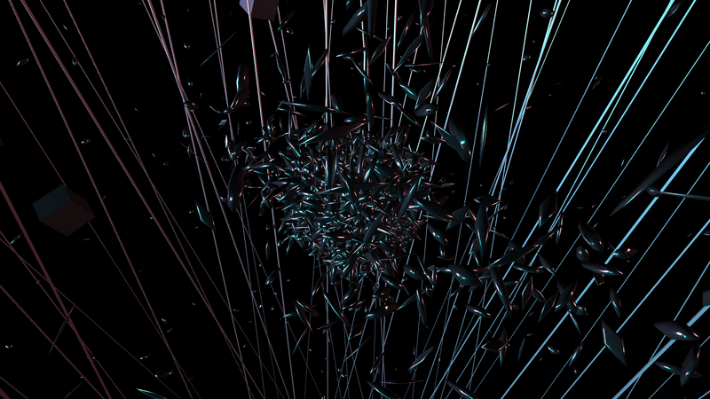

# THREE.studies II

Invocaciones audiovisuales en el navegador.

Pieza de performance audiovisual para cellista, live coder y navegador. Cello eléctrico de cinco cuerdas: Iracema de Andrade. Programación y livecoding: Emilio Ocelotl. Sonido y gráficos corren íntegramente en el navegador: síntesis granular y detección de onsets con [treslib](https://github.com/EmilioOcelotl/treslib), visuales generativos con Three.js e Hydra, y un panel REPL para intervenir la síntesis en vivo durante el performance.

Es la primera iteración de *Tres Estudios Abiertos* ([tres-app](https://github.com/EmilioOcelotl/tres-app)), junto con [anti](https://github.com/EmilioOcelotl/anti) y [risosc](https://github.com/EmilioOcelotl/risosc).

## Cómo funciona

```
pista de audio → Web Audio API → FFT (4096 bins)
                      │
                      ├─ deformación de la esfera de puntos (~3600 vértices)
                      ├─ intensidad del bloom (UnrealBloomPass)
                      └─ órbita de cámara

OnsetDetector (treslib) → en cada ataque detectado:
                      ├─ alterna sketches de Hydra (textura de toda la geometría)
                      ├─ invierte la dirección de la cámara
                      └─ seq.triggerStep() — avanza el GrainSequencer

REPL (panel en la página) → livecoding sobre g1 (GrainEngine), seq, hydraSelect…
```

- La detección de onsets usa el algoritmo psicoacústico de Nick Collins (40 bandas ERB); el tempo del secuenciador granular lo marcan los ataques, no un BPM fijo.
- Hydra renderiza a un canvas que se mapea como `CanvasTexture` sobre la esfera, tubos, anillos y planos de la escena.
- El panel REPL (`Tab` lo muestra/oculta, `Ctrl+Enter` evalúa, botón `i` para la referencia) expone `g1`, `seq`, `audioCtx`, `hydraSelect`, `GrainEngine` y `GrainSequencer`.

## Desarrollo

```bash
npm install
npm start        # dev server en http://localhost:1234
npm run build    # build de producción en dist/
```

Sin backend externo: no requiere SuperCollider ni servidores OSC. El build es un sitio estático que se publica en servidor propio.

## Versiones

Este repositorio contiene la segunda y la tercera versión de la iteración; la primera vive en [THREE.studies](https://github.com/EmilioOcelotl/THREE.studies).

**v1 — THREE.studies (2020–2022).** Gráficos en el navegador, audio en SuperCollider. Carpetas por presentación: threecln (Música UNAM, programa "Resiliencia Sonora", 2021), threeBEASTs (BEAST FEaST 2021), three-ocelotl, three2.0 y threeUNAM (2022).





**v2 — THREE.studies II con OSC (2024–2025).** El motor de sonido se muda al navegador (clases `Grain` de treslib) pero el control permanece en SuperCollider, que envía OSC vía [osc-web-server](https://github.com/EmilioOcelotl/osc-web-server). Los scripts de esa etapa se conservan en `sc/` como referencia histórica.

**v3 — sin backend (2025–2026).** Granulación, secuenciación, detección de onsets y superficie de control (REPL) dentro del navegador, con treslib desde npm. Es el estado actual del repositorio.
